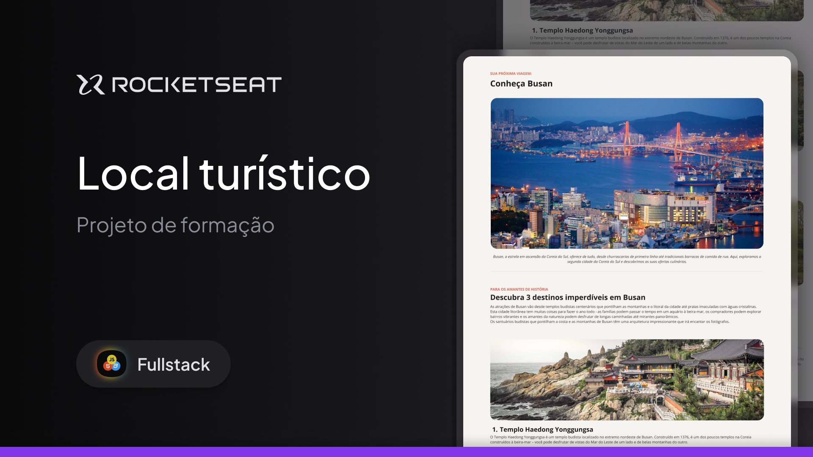

# Tourist Site Project

This project is a practical challenge that is part of the Fullstack course provided by Rocketseat.

## Challenge Description

I developed a web page with information about a specific tourist site.

### In this application, you I worked with:

- HTML structure;
- CSS styling;
- Fonts;
- Spacing;
- Images;
- Unordered lists;
- Text color changes;
- Text weight changes;

## Technologies Used

- HTML
- CSS

## Author

This project was developed by me. Feel free to reach out!